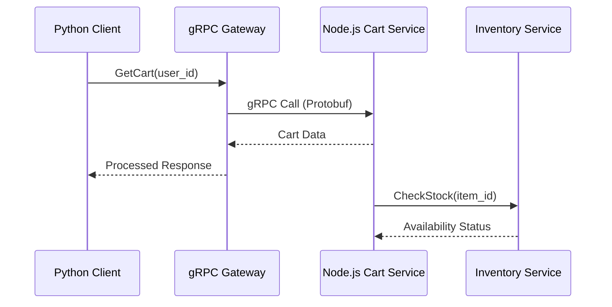

# Smart-OPD: Polyglot Microservices Architecture with gRPC


Smart-OPD is a sophisticated demonstration of a polyglot microservices architecture. It showcases high-performance inter-service communication using gRPC, service discovery, and container orchestration patterns.

## 🏗️ System Architecture

The project is divided into several autonomous services communicating via Protocol Buffers (Protobuf) and gRPC:

- 🛒 **Cart Service (Node.js):** Manages user shopping carts and persists state.
- 📦 **Inventory Service:** Handles product availability and stock management.
- 💳 **Payment Service:** Processes transactions and integrates with external gateways.
- ⚡ **gRPC Gateway:** High-performance communication bridge between Python clients and Node.js servers.

## ✨ Key Features

- **Polyglot Design:** Seamless communication between Python and Node.js services.
- **High-Performance RPC:** Uses gRPC/HTTP2 for low-latency, binary-serialized communication.
- **Service Decoupling:** Each service is independently deployable and scalable.
- **Cloud Native:** Ready for Kubernetes deployment with pre-configured manifests.
- **Automated Workflows:** Built-in serverless functions for dynamic discounting.

## 🛠️ Tech Stack

- **Languages:** JavaScript (Node.js), Python
- **Communication:** gRPC, Protocol Buffers (v3)
- **Deployment:** Docker, Kubernetes (K8s)
- **Runtime:** Node.js 18+, Python 3.9+

## 📐 Interaction Flow



## 🚀 Getting Started

### Prerequisites
- Node.js & npm
- Python 3.9+
- Docker (optional for local run)

### Installation

1. **Clone the repository:**
   ```bash
   git clone https://github.com/SayanthSatheeesh/smart-opd.git
   cd smart-opd
   ```

2. **Setup Cart Service:**
   ```bash
   cd cart-service
   npm install
   node index.js
   ```

3. **Setup gRPC Server:**
   ```bash
   cd grpc-cart
   npm install
   node server.js
   ```

4. **Run Python Client:**
   ```bash
   cd grpc-cart
   pip install grpcio grpcio-tools
   python client.py
   ```

## 📄 License

This project is licensed under the MIT License.
